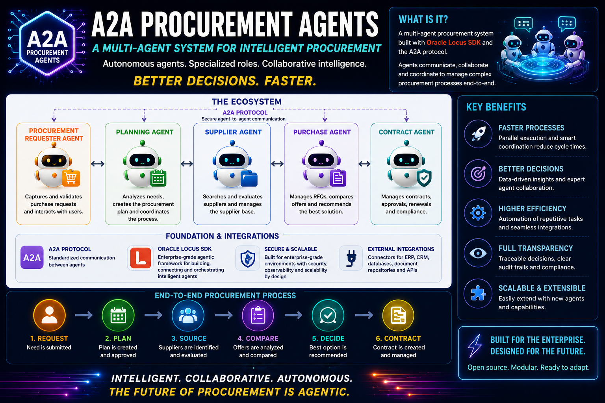

# A2A Procurement Agents

[](https://github.com/psf/black)
[](https://www.python.org/downloads/)
[](https://github.com/pylint-dev/pylint)
[](https://github.com/pytest-dev/pytest)
[](https://github.com/a2aproject/A2A)
[](https://opentelemetry.io/)



This repository is a working enterprise procurement demo built as a network of
independent AI agents.

The demo starts with a natural-language request such as "start an urgent tender
for this part and create the final purchase order automatically." From there the
system extracts and validates the request, grounds plants and parts against
procurement master data, launches an A2A orchestration, collects simulated
supplier bids, evaluates the offers against policy, persists a purchase order,
and exposes telemetry in Grafana.

The important point: this is no longer a single-agent prototype. It is an
end-to-end, containerized multi-agent workflow with UI, MCP-backed data lookup,
A2A Agent Cards, JSON Schema discovery, persistence, streaming progress events,
OpenTelemetry metrics, tests, and a root-level quality gate.

## What The Demo Does Today

The current local demo runs this path:

```text
Procurement Intake Web UI
  -> Conversational Procurement Intake Layer
  -> Procurement Data MCP Server
  -> Procurement Orchestrator
  -> Bid Collection Agent
  -> Offer Evaluation Agent
  -> Purchase Order Agent
  -> MySQL purchase order persistence
  -> OpenTelemetry Collector
  -> Prometheus
  -> Grafana
```

In practical terms, a user can:

- describe an urgent procurement need in natural language
- clarify missing information through the intake conversation
- review and edit the structured request before launch
- confirm the workflow explicitly
- watch real-time orchestration progress in the browser
- see eligible suppliers and simulated supplier bids discovered from demo data
- get a policy-based winning offer decision with explanation
- create a persisted purchase order automatically
- inspect operational and business telemetry in Grafana

The demo is intentionally small enough to run locally, but it models real
enterprise boundaries: user intake, master-data grounding, A2A service
contracts, workflow orchestration, policy evaluation, purchasing, and
observability.

## Current Status

The platform has an integrated implementation for the main urgent procurement
scenario.

Implemented and wired into the Docker Compose demo:

- Next.js Procurement Intake Web UI with chat, structured request review,
  editable fields, confirmation, and real-time workflow timeline
- Conversational Procurement Intake Layer with LLM-backed extraction,
  deterministic fallback, validation, MCP-backed grounding, A2A submission, SSE
  event relay, and polling fallback
- Procurement Data MCP Server backed by MySQL seed data for plants, parts,
  suppliers, and supplier-part relationships
- Procurement Orchestrator A2A agent with downstream A2A calls, streaming
  progress events, retry handling, and final result aggregation
- Bid Collection Agent A2A server with MCP-backed supplier discovery and
  simulated supplier offer collection
- Offer Evaluation Agent A2A server with deterministic policy guardrails,
  structured decisions, and an accuracy test suite
- Purchase Order Agent A2A server with MySQL-backed purchase order persistence,
  idempotent registration, and database-generated purchase order numbers
- JSON Schema discovery endpoints for all A2A agents
- Optional OpenTelemetry, Prometheus, and Grafana stack with provisioned A2A
  Procurement Agent Telemetry dashboard
- Root-level demo helpers, runbook, end-to-end checklist, opt-in e2e demo test,
  and repository quality gate

Still planned or intentionally future-facing:

- Compliance Agent
- authentication and authorization beyond the local demo bearer-token boundary
- distributed checkpointing and resumable workflow persistence
- production-grade supplier API integrations
- broader policy packs and approval workflows

## Why This Project Exists

Most multi-agent demos are tightly coupled: agents share runtime objects, hidden
memory, framework internals, or direct function calls. That is convenient for a
toy demo, but it is not how enterprise systems usually evolve.

This repository is intentionally different.

Each agent is treated as a black box:

- independently deployable
- independently testable
- independently versioned
- discoverable through an Agent Card
- reachable over HTTP
- integrated only through A2A protocol contracts

The goal is to demonstrate agent interoperability, not framework coupling. Each
agent owns its implementation; the contract is the boundary.

## The A2A Model

The platform uses the Agent2Agent protocol, also known as A2A, as the
communication boundary between agents.

A2A is the contract layer that lets one agent discover what another agent can do,
send it a task, exchange structured messages, stream progress, and receive task
results without knowing how the remote agent is implemented.

In this project, A2A communication means:

- **Protocol:** A2A v1
- **Transport:** HTTP
- **Message format:** JSON-RPC 2.0
- **Discovery:** Agent Cards
- **Schema discovery:** JSON Schema endpoints for A2A task contracts
- **Integration rule:** no agent depends on another agent's internal code

This matters because procurement workflows are naturally cross-domain.
Evaluation, supplier communication, compliance, purchase order generation, audit,
and orchestration can each evolve at different speeds. A2A gives those agents a
common language while preserving independent ownership.

Reference links:

- [Agent2Agent A2A specification on GitHub](https://github.com/a2aproject/A2A/blob/main/docs/specification.md)
- [Agent2Agent A2A project on GitHub](https://github.com/a2aproject/A2A)

## Runtime Foundation

Agents are implemented with [Oracle Locus](https://locusagents.oracle.com/),
used as the runtime layer for agent execution and A2A infrastructure.

Locus provides the mechanics this project needs:

- A2A server and client support
- Agent Card support
- task lifecycle handling
- protocol plumbing
- orchestration primitives
- model-provider abstraction
- observability and checkpointing foundations

Business behavior remains owned by each agent. Locus is used for runtime
support, not as a shared business-code dependency between agents.

Reference link:

- [Oracle Locus on GitHub](https://github.com/oracle-samples/locus)

## Quick Demo Start

Start the complete local demo with UI and observability from the repository
root:

```bash
./start_demo.sh --ui --observability
```

If Docker Desktop uses a non-default context:

```bash
./start_demo.sh --docker-context desktop-linux --ui --observability
```

For a backend-only run:

```bash
./start_demo.sh
```

Stop the demo:

```bash
./stop_demo.sh
```

Main local surfaces:

| Surface | URL |
| --- | --- |
| Procurement Intake UI | `http://127.0.0.1:3000` |
| Grafana | `http://127.0.0.1:3001` |
| Prometheus | `http://127.0.0.1:9090` |
| Collector metrics | `http://127.0.0.1:9464/metrics` |
| Conversational Intake Layer | `http://127.0.0.1:8012` |
| Procurement Orchestrator | `http://127.0.0.1:8003` |

For the full end-to-end checklist covering environment setup, health checks,
client invocation, UI, Grafana, and troubleshooting, see
[docs/e2e-demo.md](docs/e2e-demo.md). For the presenter path, see
[RUNBOOK.md](RUNBOOK.md).

## System Components

| Component | Type | Current state | Description |
| --- | --- | --- | --- |
| Procurement Intake Web UI | Next.js web application | Implemented | Browser entry point for intake conversation, request review, workflow launch, and real-time progress. |
| Conversational Procurement Intake Layer | HTTP application layer | Implemented | Converts natural language into validated orchestration JSON, grounds entities through MCP, and calls the orchestrator through A2A. |
| Procurement Data MCP Server | MCP server | Implemented | Exposes read-only procurement master-data lookup tools backed by MySQL demo data. |
| Procurement Orchestrator | A2A agent | Implemented | Coordinates the structured workflow across specialized A2A agents and streams progress events. |
| Bid Collection Agent | A2A agent | Implemented | Discovers eligible suppliers through MCP and collects normalized simulated supplier bids. |
| Offer Evaluation Agent | A2A agent | Implemented | Applies procurement policy, selects the winning offer, and returns an explainable structured decision. |
| Purchase Order Agent | A2A agent | Implemented | Registers purchase orders with MySQL persistence and returns technical confirmation. |
| Agent Telemetry Layer | Cross-cutting observability | Implemented, opt-in | Exports Locus/OpenTelemetry metrics to Collector, Prometheus, and Grafana. |
| Compliance Agent | A2A agent | Planned | Future compliance checks for supplier and procurement decisions. |

Detailed component descriptions are maintained in
[AGENT_CATALOG.md](AGENT_CATALOG.md).

## Demo Data And Scenario

The demo uses a synthetic automotive procurement data set stored under
[`specs/examples/data`](specs/examples/data) and loaded into MySQL by the Docker
Compose stack.

The data model covers plants, parts, suppliers, supplier-part relationships, and
reference prices. The bid collection path uses this master data to discover
eligible suppliers, while simulated supplier offers derive pricing from the
reference part cost with deterministic variance and separate shipping cost.

Example scenario:

```text
Start an urgent tender for 16 units of EV-DC-DC-009, High Voltage DC DC Converter,
for the Turin plant IT-TOR. Required delivery date is 2026-07-25.
Bid response deadline is 2026-06-15 at 17:00 UTC. Ask up to 3 European suppliers
and create the final purchase order automatically.
```

Expected result:

- the intake layer resolves the part and plant
- the orchestrator launches the A2A workflow
- the bid collection agent discovers suppliers and collects offers
- the offer evaluation agent selects the winning eligible offer
- the purchase order agent persists a purchase order
- the UI shows terminal status and Grafana updates after workflow traffic

## Spec-First Development

This repository follows a spec-first development model. Specifications live in
[`specs`](specs) and define the contracts before implementation.

The specification tree is organized by architectural concern:

- [`specs/agents`](specs/agents): A2A agent contracts and capabilities
- [`specs/schemas`](specs/schemas): JSON Schema contracts for A2A inputs,
  outputs, and events
- [`specs/data`](specs/data): procurement data model
- [`specs/discovery`](specs/discovery): schema and discovery conventions
- [`specs/layers`](specs/layers): application layers around agent interactions
- [`specs/mcp`](specs/mcp): MCP server contracts
- [`specs/observability`](specs/observability): telemetry and tracing contracts
- [`specs/ui`](specs/ui): UI behavior and interaction contracts
- [`specs/examples`](specs/examples): example datasets and reference material

Implementation must follow the specifications. When behavior changes, the
specification changes first or in the same development step.

## Repository Layout

```text
specs/
  agents/
  data/
  discovery/
  examples/
  layers/
  mcp/
  observability/
  schemas/
  ui/

services/
  bid-collection-agent/
  conversational-procurement-intake/
  offer-evaluation-agent/
  procurement-data-mcp/
  procurement-intake-ui/
  procurement-orchestrator/
  purchase-order-agent/

deployments/
  docker-compose/

docs/
images/
tests/
  e2e/
```

## Useful Links

- [Demo runbook](RUNBOOK.md)
- [End-to-end demo checklist](docs/e2e-demo.md)
- [Docker Compose deployment](deployments/docker-compose)
- [Docker Compose observability guide](deployments/docker-compose/OBSERVABILITY.md)
- [Agent catalog](AGENT_CATALOG.md)
- [Changelog](CHANGELOG.md)
- [Future extensions](FUTURE_EXTENSIONS.md)
- [Procurement Intake Web UI README](services/procurement-intake-ui/README.md)
- [Conversational Procurement Intake Layer README](services/conversational-procurement-intake/README.md)
- [Procurement Data MCP Server README](services/procurement-data-mcp/README.md)
- [Procurement Orchestrator README](services/procurement-orchestrator/README.md)
- [Bid Collection Agent README](services/bid-collection-agent/README.md)
- [Offer Evaluation Agent Quickstart](services/offer-evaluation-agent/QUICKSTART.md)
- [Purchase Order Agent Quickstart](services/purchase-order-agent/QUICKSTART.md)

## Engineering Principles

The project is designed with enterprise-grade concerns in mind:

- independent black-box agents
- deterministic external contracts
- explainable decisions
- structured validation
- MCP-backed master-data grounding
- audit-friendly workflow artifacts
- streaming progress events
- distributed tracing and metrics
- persistence at the purchase-order boundary
- policy enforcement and deterministic guardrails

Security, distributed checkpointing, resumable workflow persistence, and
approval/compliance workflows remain future evolution areas.

## Development Standards

Code and documentation follow the repository rules in [AGENTS.md](AGENTS.md).

Core standards include:

- all documentation is written in English
- Python code is formatted with `black`
- Python code is linted with `pylint`
- tests are written with `pytest`
- the Procurement Intake Web UI passes TypeScript type checking
- Python docstrings use Google docstring format
- every meaningful change is documented in the changelog

Run the repository quality gate before considering a development step complete:

```bash
./check.sh
```

The script runs `black --check`, `pylint`, `pytest`, and the Procurement Intake
Web UI TypeScript typecheck. Python checks run through the
`a2a-procurement-agents` conda environment. If UI dependencies are missing,
install them first:

```bash
cd services/procurement-intake-ui
npm ci
```

## License

This project is licensed under the MIT License. See [LICENSE](LICENSE).
